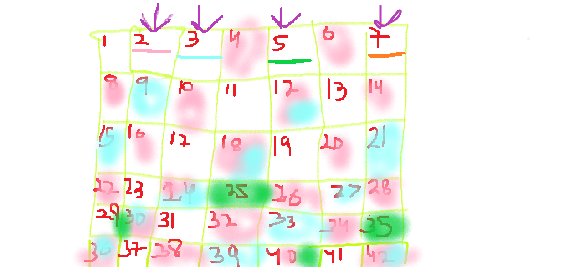

- The sieve of Eratosthenes first makes all numbers prime.
 
- Then it checks for all multiples of a prime number and marks them as non-prime.
 
- The multiples are checked starting from <i>pXp that is prime number sqaure because all previous multiples have been taken care of.</i>
 
- For example for 5, 5X2,5X3 is not prime but that has been checked by 2X5 and 3X5.
 
- Similarly we do not even check for factors of non prime numbers.
 
- Refer to the image below:
 

